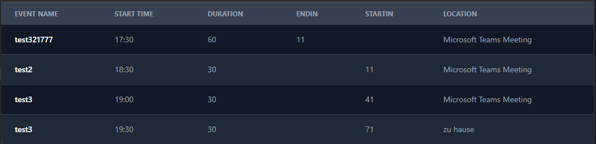

# Svelte_Frontend-for-Outlook-calendar-widget

Create a little Frontend for my PowerShell SQLite backend

## connection to database

The connection is done to the SQLite database which gets updated by the PowerShell backend script from this repo:

[Link to PowerShell backend repo](https://github.com/golfomania/PowerShell_OutlookCalendarEventsWidget)

## rxjs

I used rxjs to create an observable for the database connection inside the component to trigger a refresh of the database data every 10 seconds.

## tailwindcss & flowbite

I used tailwindcss and flowbite for the frontend design.

## show in chrome without the top navigation bar

In Chrome, open the 3-dot menu on the top right.
There in the save and share section create a shortcut and select "open as window".
You can also pin this shortcut to the taskbar.
the page is now opened without the top navigation bar.

## run the app locally

npm run build

npm run preview

=> tested successfully

## current status

## TODO / more ideas for the future

- [ ] change favicon
- [x] add loading spinner
- [x] handle too long names
- [x] softdelete events
- [ ] add color to events based on time to start / end
- [ ] integrate backend in svelte app
- [ ] trigger PowerShell script from frontend
- [ ] add animations
- [ ] run database & frontend on server instead of local
